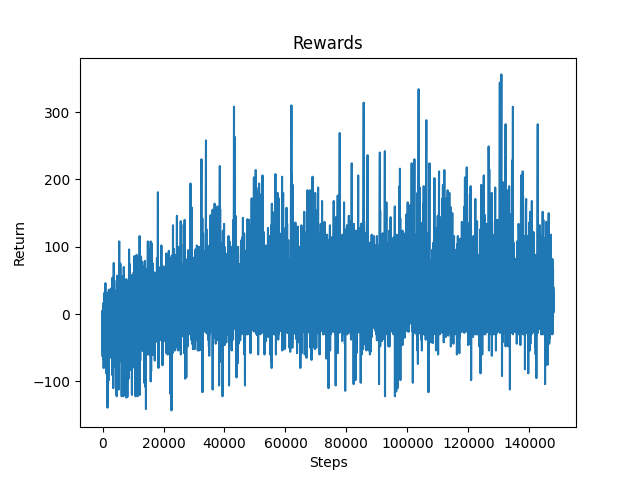
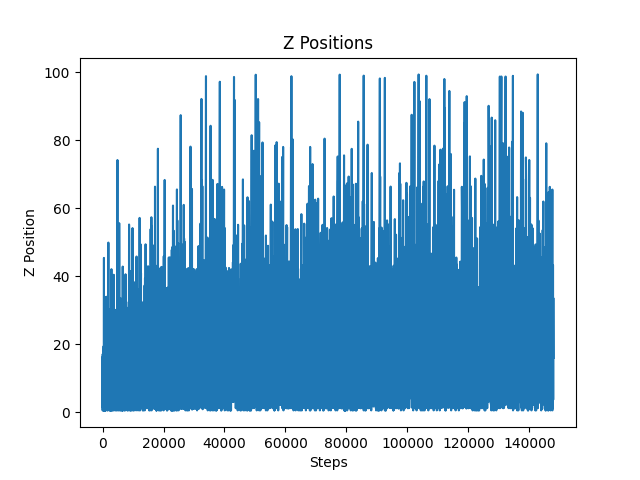
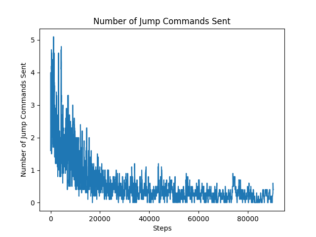
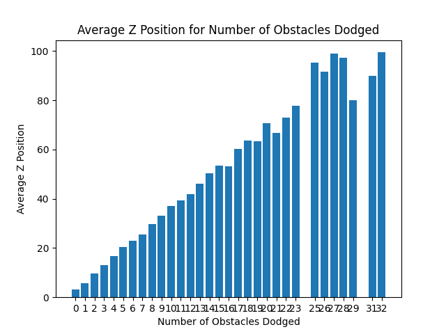
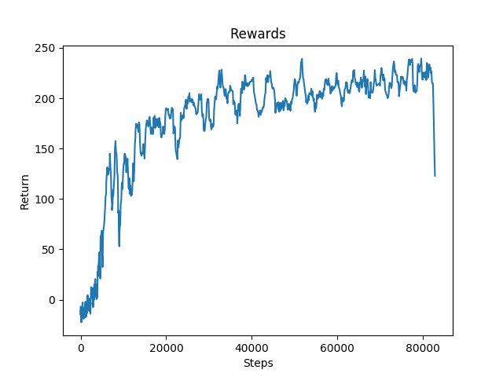
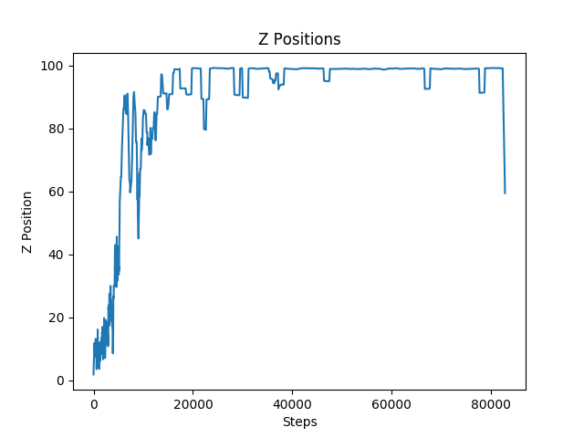
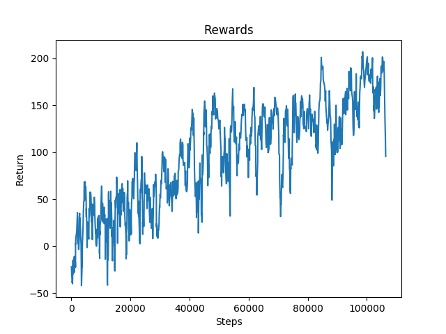
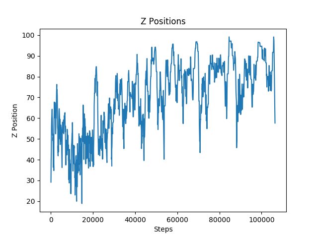
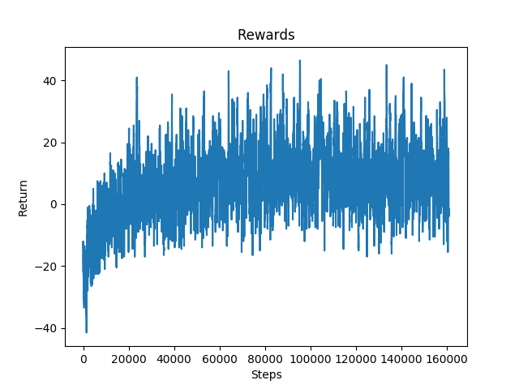
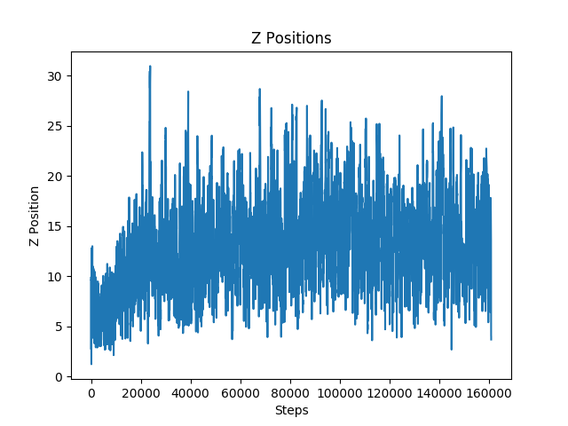

## Final Report

### Video Summary
<iframe width="640" height="360" src="./final.mp4" frameborder="0" allow="accelerometer; encrypted-media; gyroscope; picture-in-picture" allowfullscreen></iframe>

### Project Summary
Minecraft Surfers was modeled after the widely known mobile game Subway Surfers. The goal of the game and our project is to survive on the map as long as possible while avoiding obstacles. In Minecraft Surfers, an agent is placed at the start of a 100 block long three lane track which has randomly placed obstacles. These obstacles include emerald block walls, diamond block overheads, and ditches. As the agent constantly moves forward, it has the ability to dodge these obstacles by strafing left or right and jumping. The agent receives a 10 x 3 grid which is a representation of the agent’s current row and the nine rows ahead of it. Given this observation space as input, the agent must strategically dodge the obstacles it encounters and successfully reach the end of the track.

### Approach

#### Discrete to Continuous
The first major change that was incorporated into Minecraft Surfers, since the status report, was the switch from a discrete agent to a continuous agent. This switch was necessary to both to increase the complexity of our project and handle the issue of not being able to strafe and move forward simultaneously. In Subway Surfers, the main player moves discretely from lane to lane. However, this behavior cannot be replicated using Malmo so we allowed the agent to freely move between lanes by enabling it to continuously send strafe commands. To keep the agent within the bounds of the track, we restricted the commands the agent could send based on its position. For example, if the agent was in the leftmost lane, it would only be allowed to send strafe commands with a nonnegative value.

#### New Obstacles
The next major change was the addition of ditches. Initially, we had planned on using the emerald blocks as hurdles which the agent would need to jump over. In our environment, touching an emerald block results in the agent’s death. If the agent jumps onto the hurdle or runs into a hurdle, it should die but if the agent successfully jumps completely over a hurdle, it should survive. However, since Minecraft agents are unable to jump over an entire block without touching it, we were unable to use blocks as hurdles. For this reason, we chose to switch from hurdles to ditches. 

After the addition of ditches, the agent would constantly jump as there was no reason for it not to. To discourage the agent from jumping without reason, we added overhead obstacles throughout the track so it would be punished for jumping into one. This was not enough for the agent to learn to only jump over ditches. In order to fix this issue, we added glass blocks above all positions which did not have a ditch and stained glass blocks above positions which did. If the agent jumps and hits a glass block, it would be punished with a negative reward, but if the agent jumped and hit a stained glass block, it would receive a positive reward. 

The addition of glass blocks was an overcorrection as the agent began receiving too many negative rewards. The agent found jumping to be disadvantageous and would strafe around ditches instead. To help the agent learn to jump appropriately, we randomly replaced some rows in our tracks with canyons, a full row of ditches. This would force the agent to jump as it would not be able to strafe around a canyon. 
 

#### Obstacle Density
After the switch to continuous movements and the addition of new obstacles, the agent began to struggle due to how compactly the obstacles were placed within the track. To counteract this issue, we added density constants within our track generator. This allowed us to control the compactness of these obstacles and train our agent on a track that was more manageable.
 

#### Observation Space
Our observation space has remained the same since the status report (a 10 x 3 grid that represents the agent’s current row and the 9 rows ahead of it) except the addition of three coordinates – the x position, the relative x position, and the relative z position. With its x position, the agent knows which lane it is currently in. The other two coordinates inform the agent of its relative position within its current block. These two coordinates help the agent understand if it needs to strafe slightly within its current lane to avoid hitting its shoulder against the side of a wall.
 

#### Action Space
The two changes made to the agent’s action space are the addition of the jump command and the switch to continuous movements.
 

#### Rewards
Death (running into a wall, falling into a ditch, jumping into an overhead obstacle): -30 points
Jumping over a ditch and hitting a stained glass block: +10 points
Jumping and hitting a glass block: -5 points
Surviving a row: +2 points
 

#### Reinforcement Learning Algorithm
We used RLlib’s base neural network with the Proximal Policy Optimization (PPO) reinforcement learning algorithm. The reward function for this algorithm is: 

    

The Proximal Policy Optimization (PPO) algorithm is a reinforcement learning algorithm which updates its decision-making policy by learning from a set of experiences that were obtained from its previous decision-making policy. These sets of experience are never reused to update the decision-making policy – the algorithm only learns from the experiences it has collected from its latest policy. The PPO algorithm also constrains the degree to which its policy is updated on each iteration to ensure that it does not follow a misguided path due to one set of experiences.

### Evaluation
#### Quantitative Results

    
    <h4>Figure 1</h4>

After training our agent for 140,000 steps, we can see significant improvement within the rewards graph. The rewards do not give a full picture of the agent’s performance because they do not indicate if the agent was consistently able to reach farther into the track. However, when paired with information such as the z-position, or the distance the agent traveled in each episode, the improvement within the rewards graph can be correlated with the agent’s success. It can be seen that the rewards start to plateau near 80,000 steps. This is because the agent began to successfully reach the end of the track and received the maximum reward possible.

    
    <h4>Figure 2</h4>

The figure above shows that the agent was consistently improving throughout training as it was reaching farther distances on each episode. Near the end of this training session, our agent was successfully reaching the finish line of our track as can be seen by the cluster of lines that reached a z position of 100.

    
    <h4>Figure 3</h4>

As we started digging deeper into our project, we reran our agent to collect more metrics. The graph above shows the number of jump commands that the agent sent compared to the number of steps it took. An untrained model would send many jump commands because it had not learned the purpose of jumping yet while a trained model would have learned that it was disadvantageous to jump continuously (Refer to New Obstacles under Approach). The decrease in jump commands sent by the agent displays that the addition of the glass blocks and overhead obstacles was effective in teaching our agent that it only needed to jump over the ditches or canyons.

Another metric we recorded was the average number of times the agent decided to jump over a ditch versus strafe around a ditch. Before we added canyons our agent would only decide to jump over a ditch 20.5% of the time. However, after adding canyons to the track, the agent would jump over a ditch 56.6% of the time. The increase in the average shows that by tweaking the environment in this way, the agent learned to jump over the ditches instead of strafe around them.

    
    <h4>Figure 4</h4>

An additional metric we used to measure the performance of our agent was the average z position versus the number of obstacles the agent dodged. This metric was useful because it indicated that in the episodes where the agent made it farther down the track, it also dodged a higher number of obstacles. This means that the agent did not luck out with an easy track but the agent was able to dodge numerous obstacles and make it further down the track.

To determine the agent’s performance on each obstacle, we isolated each one in its own environment.
 

##### Overhead Obstacle

    
    <h4>Figure 5</h4>

    
    <h4>Figure 6</h4>

As expected, the overhead obstacle was the easiest obstacle for the agent to learn to avoid. The only way the agent could die was by jumping into one. The agent simply had to learn not to jump and it could easily avoid all of the overhead obstacles and consistently reached the finish line.
 

##### Ditches

    
    <h4>Figure 7</h4>

    
    <h4>Figure 8</h4>

The ditches were more complex to avoid as the agent had to decide between jumping over the obstacle or strafing around it. For this reason, the agent was not able to reach the end of the track as consistently as it did with the overhead obstacles. The agent took only 2,000 steps to consistently reach the finish line for the overhead obstacles. However, the agent took a little over 10,000 steps to master the environment with only ditches.
 

##### Walls 

    
    <h4>Figure 9</h4>

    
    <h4>Figure 10</h4>

#### Qualitative Results
The GIFs on the left displays how the agent performs before training with the corresponding obstacle while the GIFs on the right display how it performs after training.
 

##### Overhead Obstacles

    
    
     

In the environment with only overhead obstacles, the untrained agent jumps without reason. After learning that the only way to survive in this environment is by not jumping into overhead blocks, the agent stops jumping altogether.

##### Ditches

    
    
     

The untrained agent is unable to time its jumps and thus, falls into the ditches. However, after training, the agent learns how to jump over the ditches and successfully reaches the finish line.
 

##### Walls

    
    
     

The untrained agent randomly strafes and jumps around the environment. After it learns that it does not need to jump to avoid the obstacles in this environment, it decides to only strafe around the track.

Please refer to the commentary in our video for qualitative insight about the performance of our complete model.

### Resources Used
- [Project Malmo](https://github.com/microsoft/malmo)
- [Project Malmo XML Schema Documentation](https://microsoft.github.io/malmo/0.14.0/Schemas/MissionHandlers.html)
- [RLlib](https://docs.ray.io/en/master/rllib.html)
- [Keras CNN](https://keras.io/api/layers/convolution_layers/)
- [OpenAI PPO](https://openai.com/blog/openai-baselines-ppo/)
- [PPO Algorithm](https://towardsdatascience.com/proximal-policy-optimization-tutorial-part-1-actor-critic-method-d53f9afffbf6)
- Thanks for all your help Kolby!
