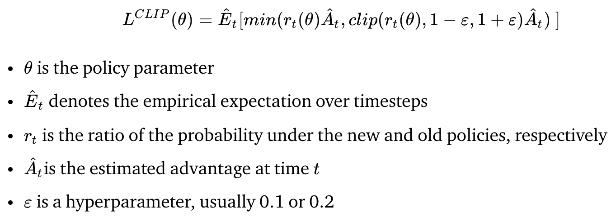
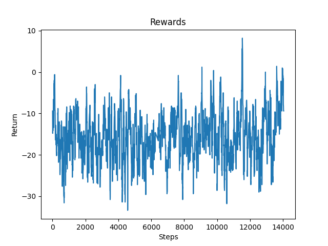
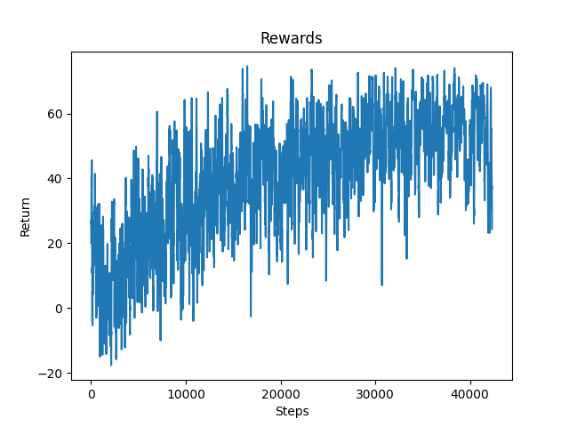
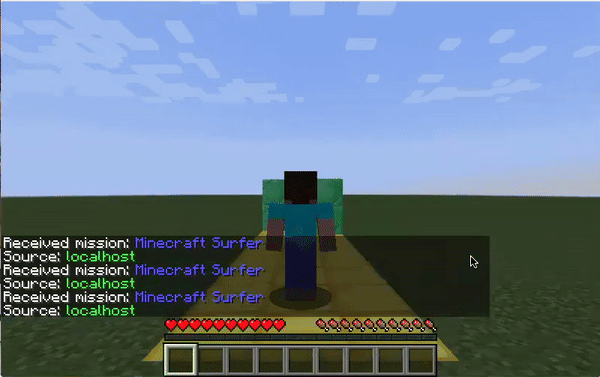

## Final Report

### Video Summary
<iframe width="640" height="360" src="./final.mp4" frameborder="0" allow="accelerometer; autoplay; encrypted-media; gyroscope; picture-in-picture" allowfullscreen></iframe>

### Project Summary
Our project Minecraft Surfers is modeled after the mobile game Subway Surfers where the goal is to survive as long as possible while dodging obstacles. In our version, an agent is placed on a 100 block long three lane track which has randomly placed emerald blocks as obstacles. While the agent continuously moves forward, it will be able to move left, move right, jump, or crouch to avoid obstacles in its path. For the prototype, we have limited the agent’s actions to moving left or right and limited the track size. To detect these obstacles, the agent is given a 10 x 3 grid which represents its current row and the nine rows ahead of it. The agent must strategize a path to take to successfully reach the end of the track. 

### Approach
We started building this project by creating a track generator which returns a track with random patterns of obstacles. This generator uses two constants to alter the frequency at which obstacles are placed. One constant controls if an obstacle is placed within a row and the other controls how many obstacles will be placed in that row. We implemented a depth-first search algorithm in order to check if there is a clear path to the end of the track for each pattern generated.

While creating our prototype, we tried using two types of neural networks to make the agent’s decisions.

Initially, we tried a Keras convolutional neural network (CNN) using Q-learning, which consisted of six layers: Convolution1D, Activation, MaxPooling1D, Activation, Flatten, and Dense. We chose to use CNN so that the model would be able to recognize patterns of obstacles on a track and choose a series of appropriate actions to solve each pattern of obstacles. However, we quickly realized that a CNN would be unnecessarily complex given our current observation space. Each convolution over the input grid resulted in a loss of critical information about position. After a few trial runs with the CNN, it was clear the model believed simply moving forward was more beneficial than avoiding obstacles. 

We then switched to using RLlib’s base neural network with the Proximal Policy Optimization (PPO) reinforcement learning algorithm. The reward function for this algorithm was:

    

The agent’s action space consists of three possible actions, “strafe -1” (move left), “strafe 0” (stay in current position), and “strafe 1” (move right). The observation space consists of a 10 x 3 grid which represents the agent’s current row and the 9 rows ahead of it. We then had to decide on whether to send the agent commands discretely or continuously.

Giving the agent continuous movement commands caused it to move inconsistently. For example, sending the agent “strafe 1” would result in it strafing 0.7 blocks to the right rather than 1 block. This inconsistency was problematic because occasionally the agent would strafe to the middle of two blocks causing its shoulder to hit an obstacle even though it believed it was safe in the middle of the lane it strafed to. To solve this issue, we passed the agent its x-position so that it could learn to strafe all the way to the middle of the next lane. Unfortunately, the agent was unable to learn to strafe completely so we switched to giving the agent discrete movement commands for the prototype. Discrete movement commands guaranteed that the agent would always be in the center of a lane and never unintentionally hit a wall.

### Evaluation
For the quantitative results, we mapped the rewards the agent received over time. Our reward system consisted of three types of rewards. If an agent ran into a wall, it would be punished by -30 points. The agent was rewarded with 2 points for every row it advanced on the track and rewarded with 30 points if it successfully finished the track. This was an ideal reward system because it would be rewarded for surviving rather than avoiding obstacles and only punished for dying.

    
    <h4>Figure 1: Continuous Agent</h4>

As you can see from the previous graph, the continuous agent did not improve even after 10000 steps. This was primarily due to the fact that the continuous agent would occasionally run into a wall with its shoulder after having strafed to avoid it. This action may have led it to believe that avoiding obstacles was not necessarily beneficial behavior. 

    
    <h4>Figure 2: Discrete Agent</h4>

On the other hand, the discrete agent was able to complete almost every track successfully by the end of its training. The experiment with the discrete agent showcases that it is possible for an agent to learn to avoid obstacles with the PPO reinforcement learning algorithm and provides a baseline for us to improve our continuous agent. We still want to maneuver to using a continuous agent because a discrete agent does not have all of the functionalities a continuous agent does (e.g. crouching and strafing while moving forward).

    
    <h4>Figure 3: Discrete Agent on Track</h4>

For the qualitative results, from the GIF above, we can see the agent trying to make decisions such as strafing right to avoid obstacles directly ahead of it. In this situation, the agent is also able to reach the end of the track.

### Remaining Goals and Challenges
For the next few weeks, we will focus on adding jump and crouch into the agent’s action space and increasing the track length to 100. 

One of the challenges we faced was trying to combine discrete commands with continuous commands in Malmo. In Subway Surfers, the main character is moving forward continuously but switches lanes, jumps, and crouches discretely. Unfortunately, the Malmo agent is unable to mimic this behavior as discrete commands are only accepted when it is standing in the center of a block. After noticing this issue, we have decided to maneuver to either a completely discrete agent or a completely continuous agent.

To create an interesting project with a discrete agent, we must come up with difficult tracks, multiple obstacles and power ups such as a speed boost. Currently, a rule-based agent would be able to solve our simple maps, so this does not demonstrate an interesting reinforcement learning problem. However, we found that Malmo does not offer the option to speed up or slow down the discrete agent. If we decide to continue on our path with the discrete agent, we must find a way to create a more challenging environment.

On the other hand, for a continuous agent we must find a way to solve the problem of its inconsistent positioning, resulting in its unintended collisions with obstacles. Additionally, if we are able to solve this issue, a continuous agent allows us the flexibility to complicate the environment by including the previously mentioned power-ups as well as the ability to crouch.

### Resources Used
- [Project Malmo](https://github.com/microsoft/malmo)
- [Project Malmo XML Schema Documentation](https://microsoft.github.io/malmo/0.14.0/Schemas/MissionHandlers.html)
- [RLlib](https://docs.ray.io/en/master/rllib.html)
- [Keras CNN](https://keras.io/api/layers/convolution_layers/)
- [OpenAI PPO](https://openai.com/blog/openai-baselines-ppo/)