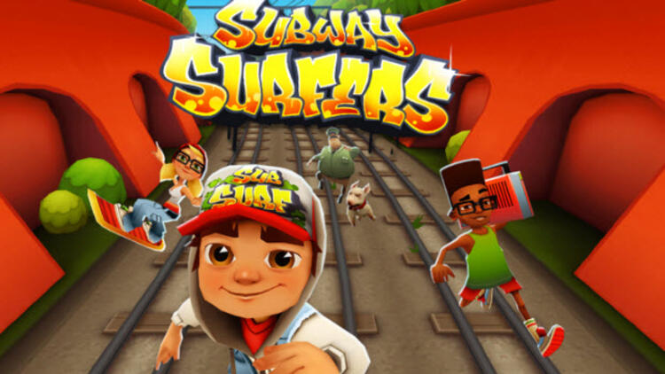
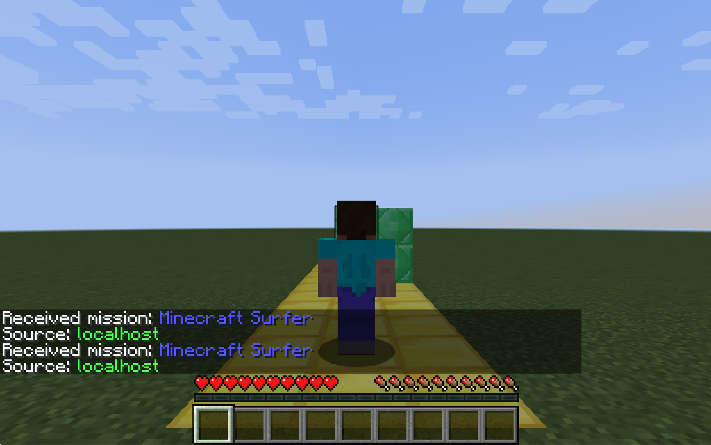

## Welcome to Minecraft Surfers!
Our team is building an agent which can learn to play a modified version of Subway Surfers rebuilt in Minecraft. Similar to Jake from Subway Surfers, Steve has to dodge obstacles along a track while picking up gold nuggets and occasionally, potions. Steve has the ability to switch lanes, jump, and crouch to avoid obstacles and successfully reach the end of the track.

## Source code: 
https://github.com/SahilRailkar/minecraft-surfers

## Reports:
- [Proposal](proposal.html)
- [Status](status.html)
- [Final](final.html)