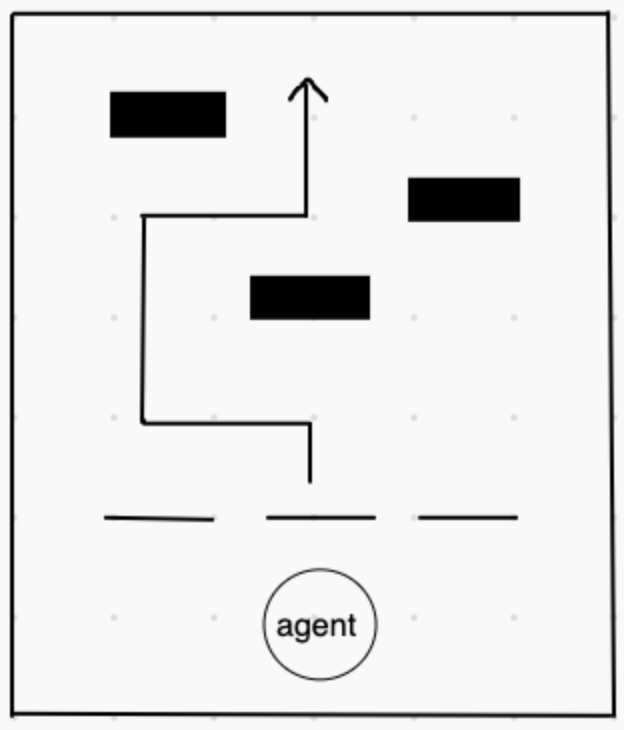

## Summary of the Project
The goal of our project is to have an agent successfully reach the end of a track while avoiding obstacles and collecting gold nuggets to maximize its score. This idea is based on the game Subway Surfers. The agent will constantly be moving forward at a speed of 1 block/second. The agent will encounter three types of obstacles which can be avoided by either moving 1 block left or right (3 block wide path), crouching, or jumping. There are also four types of powerups – Potion of Speed, Jump Boost, Slowness, and Poison. The agent will use its view to detect obstacles and choose the correct action. The agent can view a 6 x 3 x 3 grid of the blocks in front of it. If the agent runs into an obstacle or collects the Potion of Poison, it will lose a life and after it has lost two, it will die :(

## AI/ML Algorithms
We will use a deep reinforcement learning algorithm with neural networks for this project.

## Evaluation Plan
For the quantitative evaluation, we will be using the distance traveled, the number of gold nuggets collected, the number of obstacles avoided, and the types of powerups collected as our metrics. The agent will receive a higher score for traveling farther, collecting more gold nuggets, and avoiding more obstacles. For example, an agent would receive 1 point for every block traveled, 2 points for every gold nugget collected, and 4 points for every obstacle avoided. The agent will also be rewarded for collecting the powerups Potion of Slowness and Potion of Jump Boost and be punished for collecting the powerups Potion of Speed and Potion of Poison. The Potion of Slowness and the Potion of Jump Boost may help the agent complete the map efficiently, however the other two potions may make it more difficult for the agent to complete the map. For every obstacle the agent hits or Potion of Poison the agent collects, the agent will lose a life and will lose 30 points. Our baseline for success is that the agent should be able to avoid at least one of every type of obstacle in the track. On the other hand, our baseline for failure is that the agent is unable to avoid a single obstacle in the track. 

For our approach, the sanity cases will be if the agent can choose to collect gold nuggets and avoid obstacles and the Potion of Poison. Our moonshot case is if the agent is able to successfully make it to the end of the track while maximizing its score by collecting gold nuggets. If we have additional time, attempt to incoroporate moving obstacles into the track.

We will be generating our tracks to force our agent into making a strategic decision to avoid current and future obstacles as well as maximizing its overall score.

For example, in this track, the agent should choose to switch to the left path rather than the right path though no obstacle exists directly ahead of it in either path.

## Appointment with the Instructor
3:00pm - 3:15pm, Wednesday, January 20, 2021

## Weekly Meeting
11:00am - 12:00pm Sundays
